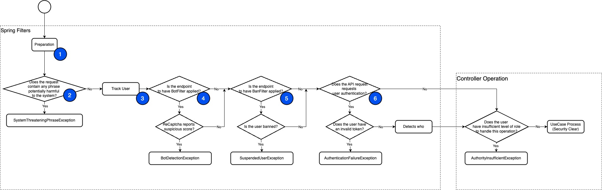
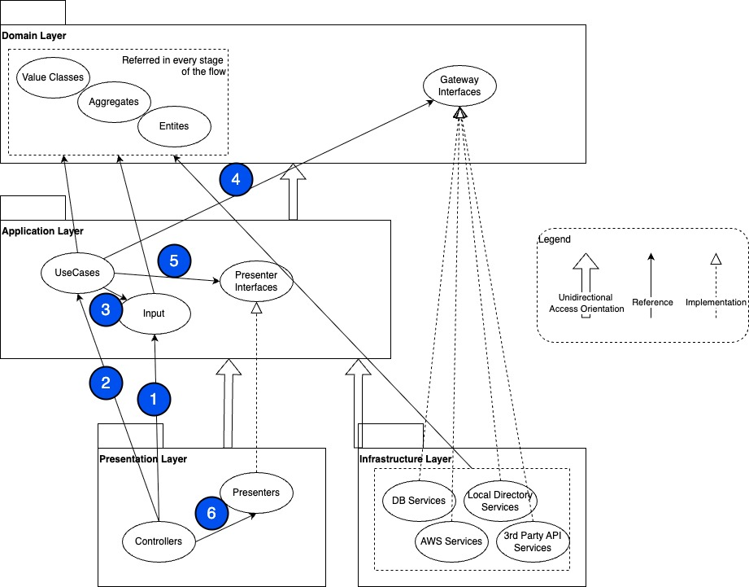

# Backend

## Contents

- [Backend Security](./backend.md/#Backend-Security)
- [Backend Architecture](./backend.md/#Backend-Architecture)

## Backend Security

Backend REST API Endpoints are protected by some security measures, which are mainly invoked by Filters (a Spring Boot concept).

1. [WrapRequestOnFilter.java](/src/main/java/org/herovole/blogproj/presentation/filter/WrapRequestOnFilter.java)  
   Preparation. It just converts the request to a cached data type.  
   (Without this, the http request takes form of stream that evaporates upon first read.)

2. [SystemThreateningPhraseFilter.java](/src/main/java/org/herovole/blogproj/presentation/filter/SystemThreateningPhraseFilter.java)  
   Protects the entire service from malicious attempts.  
   Scans the strings in the request. Checks all phrases potentially harmful to the system. e.g. "update ~ set ~" used often for SQL Injection.

3. [TrackPublicUserByFilter.java](/src/main/java/org/herovole/blogproj/presentation/filter/TrackPublicUserByFilter.java)  
   Checks its cookie to see if the user has ever previously visited. Assigns a new ID if he/she is a new visitor.

4. [BotFilter.java](/src/main/java/org/herovole/blogproj/presentation/filter/BotFilter.java)  
   Protects some publicly exposed contact points from programmatic accesses.  
   Checks Google ReCaptcha score to see whether the access is organic or not.

5. [BanFilter.java](/src/main/java/org/herovole/blogproj/presentation/filter/BanFilter.java)  
   Protects the public user comment functions from misbehaving users.  
   Checks its public user ID and IP to see whether he/she is banned from the user comment functions.

6. [AuthFilter.java](/src/main/java/org/herovole/blogproj/presentation/filter/AuthFilter.java)  
   Protects the Admin only operations from the public users.  
   Checks its token to see if he/she is an admin user.

## Backend Architecture

A modified Clean Architecture is adopted. (let me abbreviate it as CA)  
The flow of an endpoint process after passing the previously mentioned security measures is  

1. The Controller builds an Input data.  
   Here, it converts raw REST API payload to Domain level objects.  
   - Examples of Controllers : [AdminV1ArticleController.java](/src/main/java/org/herovole/blogproj/presentation/controller/AdminV1ArticleController.java), [AdminV1UserCommentController.java](/src/main/java/org/herovole/blogproj/presentation/controller/AdminV1UserCommentController.java)  
   - Examples of Inputs : [FindArticleInput.java](/src/main/java/org/herovole/blogproj/application/article/findarticle/FindArticleInput.java), [EditArticleInput.java](/src/main/java/org/herovole/blogproj/application/article/editarticle/EditArticleInput.java), [PostUserCommentInput.java](/src/main/java/org/herovole/blogproj/application/user/postusercomment/PostUserCommentInput.java)

2. The Controller passes Input data to a UseCase.  
   True CA : UseCases have interfaces on Application Layer, and implementations also on Application Layer.  
   My Case : Each UseCase has a single implementation on Application Layer.  
   - Examples of UseCases : [FindArticle.java](/src/main/java/org/herovole/blogproj/application/article/findarticle/FindArticle.java), [EditArticle.java](/src/main/java/org/herovole/blogproj/application/article/editarticle/EditArticle.java), [PostUserComment.java](/src/main/java/org/herovole/blogproj/application/user/postusercomment/PostUserComment.java)

3. and - 
4. The UseCase performs its job by means of Input data and pre-defined Gateway interfaces(like database access).  
   True CA = My Case : Gateways have interfaces on Application Layer, and implementations on Infrastructure Layer.  
   No reference from Application Layer to Infrastructure Layer is permitted.  
   - Examples of Gateway Interfaces : [ArticleDatasource.java](/src/main/java/org/herovole/blogproj/domain/article/ArticleDatasource.java), [ArticleTransactionalDatasource.java](/src/main/java/org/herovole/blogproj/domain/article/ArticleTransactionalDatasource.java), [UserCommentDatasource.java](/src/main/java/org/herovole/blogproj/domain/comment/UserCommentDatasource.java), [UserCommentTransactionalDatasource.java](/src/main/java/org/herovole/blogproj/domain/comment/UserCommentTransactionalDatasource.java)    
   - Examples of Gateway Implementations : [ArticleDatasourceMySql.java](/src/main/java/org/herovole/blogproj/infra/datasource/ArticleDatasourceMySql.java), [ArticleTransactionalDatasourceMySql.java](/src/main/java/org/herovole/blogproj/infra/datasource/ArticleTransactionalDatasourceMySql.java), [UserCommentDatasourceMySql.java](/src/main/java/org/herovole/blogproj/infra/datasource/UserCommentDatasourceMySql.java), [UserCommentTransactionalDatasourceMySql.java](/src/main/java/org/herovole/blogproj/infra/datasource/UserCommentTransactionalDatasourceMySql.java)

5. The result gets handed in to a Presenter interface.  
   True CA = My Case : A Presenter has an interface on Application Layer, and an implementation on Presentation Layer.  
   No reference from Application Layer to Presentation Layer is permitted.  
   - Example of Presenter Interfaces : [GenericPresenter.java](/src/main/java/org/herovole/blogproj/application/GenericPresenter.java)

6. The Controller orders the Presenter to build a JSON string for the REST API response.  
   True CA : The Presenter is anticipated to return REST API response directly.  
   My Case : The Controller mediates the REST API response.(Spring Boot REST API Controller specification)  
   - Examples of Presenter Implementations : [FindArticlePresenter.java](/src/main/java/org/herovole/blogproj/presentation/presenter/FindArticlePresenter.java), [BasicPresenter.java](/src/main/java/org/herovole/blogproj/presentation/presenter/BasicPresenter.java)  

