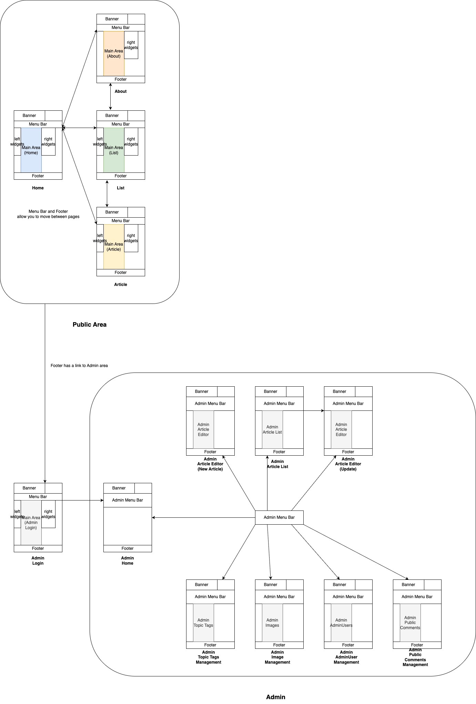

# Site Description

## Contents

- [Prerequisites](./website.md/#Prerequisites)
- [UI Flow](./website.md/#UI-Flow)
- [Public User Services (5 items)](./website.md/#Public-User-Services)
- [Admin Services (8 items)](./website.md/#Admin-Services)
- [3rd Party Frontend Components](./website.md/#3rd-Party-Frontend-Components)

## Prerequisites

(*) ... protected by Google ReCaptcha

## UI Flow

## Public User Services
### Home
[publicPageHome.tsx](/src/main/js/public/publicPageHome.tsx)  
The website home.  
A public user can see a list of recently added articles.

### Article
[publicPageArticleView.tsx](/src/main/js/public/publicPageArticleView.tsx)  
An individual article page.  
It's composed of the following sections.
- Cover  
  Contains an image, source URL, and the timestamp of publication.
- Source Comments  
  Contains translated comments from the source URL.
- User Comments (*)  
  Contains comments from the public users. For each comment, a user can
    - Rate the comment (Good/Bad)
    - Report the comment (opens a modal window)
- User Comment Form (*)  
  A public user posts a comment.  (opens a modal window)

### List
[publicPageArticleList.tsx](/src/main/js/public/publicPageArticleList.tsx)  
The page where a public user can search articles in the past.  
It's composed of the following sections.
- Search Menu  
  A public user inputs
    - number of items per page
    - search keywords
    - topic classification
    - country
    - date range  
      to obtain a list of articles as a result.
- Search Result  
  The list of the articles specified by the search menu.

### About
[publicPageAbout.tsx](/src/main/js/public/publicPageAbout.tsx)  
Website information. RSS, my mail address, etc...

### (Common Components)
Also, these pages have common components.
- Header  
  [publicHeader.tsx](/src/main/js/public/fragment/publicHeader.tsx)  
  A small menu for switching between Home, List, and About.
- Footer  
  [footer.js](/Users/devel/Documents/home/git/blog-proj/src/main/js/footer.js)  
  Almost the same to the Header. Has a link to the Admin Entrance.
- Left Gadgets  
  [gadgetsLeft.tsx](/src/main/js/public/fragment/gadget/gadgetsLeft.tsx)  
  Introduces relevant articles based on
    - the timestamps of the latest user comments.
    - topic classification of the latest article visited by a user.
    - country of the latest article visited by a user.
- Right Gadgets  
  [gadgetsRight.tsx](/src/main/js/public/fragment/gadget/gadgetsRight.tsx)  
  External links to other Translated/non-Translated Matome Blogs required by the terms of exchange with Matome Antennas.

## Admin Services

### Login Form (*)
[adminPageLogin.tsx](/src/main/js/admin/adminPageLogin.tsx)  
2-Factor-Auth. A user needs
- phase1 : user name, password
- phase2 : user name, password, 6-digit phrase sent by e-mail

### Admin Home
[adminEntrance.tsx](/src/main/js/admin/adminEntrance.tsx)  
There's a button to regenerate RSS files.

### Admin Article Editor (New Article) (Update)
[adminPageArticleNew.tsx](/src/main/js/admin/adminPageArticleNew.tsx)  
[adminPageArticle.tsx](/src/main/js/admin/adminPageArticle.tsx)  
An admin user builds an article here. The menu includes
- main image
- title
- main text
- publish/not flag, publish timestamp
- source info (URL, original title, date)
- source comments
    - comment number
    - nationality
    - comment text
    - referring comment number

### Admin Article List
[adminPageArticleList.tsx](/src/main/js/admin/adminPageArticleList.tsx)  
In addition to the Search options for the public users, it offers
- published/not ... an admin user can list non-published articles.
- sort options ... an admin user can sort the articles by ID and the timestamp of the latest user comments, in addition to the timestamp of article publication which is the default.

### Admin Topic Tags Management
[adminPageTopicTagList.js](/src/main/js/admin/adminPageTopicTagList.js)  
Offers services to Create/Read/Update topic classifications  
e.g. Society, IT-Digital, Life

### Admin Image Management
[adminPageImages.tsx](/src/main/js/admin/adminPageImages.tsx)  
Offers services to Create/Read/Delete cover images

### Admin AdminUser Management
[adminPageUsers.tsx](/src/main/js/admin/adminPageUsers.tsx)  
Offers services to Create/Read/Update Admin users

### Admin Public Comments Management (*)
[adminPageUserComments.tsx](/src/main/js/admin/adminPageUserComments.tsx)  
Offers services to list the public user comments and the reports they receive.  
An admin user can search comments by
- keywords
- date range
- whether it's reported by other users or not
- whether a comment has reports not handled by the admin users

and for each comment
- hide/show
- ban public user by cookie ID
- ban public user by IP
- check whether each report is handled or not

## 3rd Party Frontend Components
- Google ReCaptcha v3  
  placed on forms with Post/Put methods with public user interaction or some critical Admin features.
- Livedoor 相互(mutual) RSS   
  My webservice has an account for it. It offers a portal to register RSS files of external Matome Antenna to build external links automatically.  
  